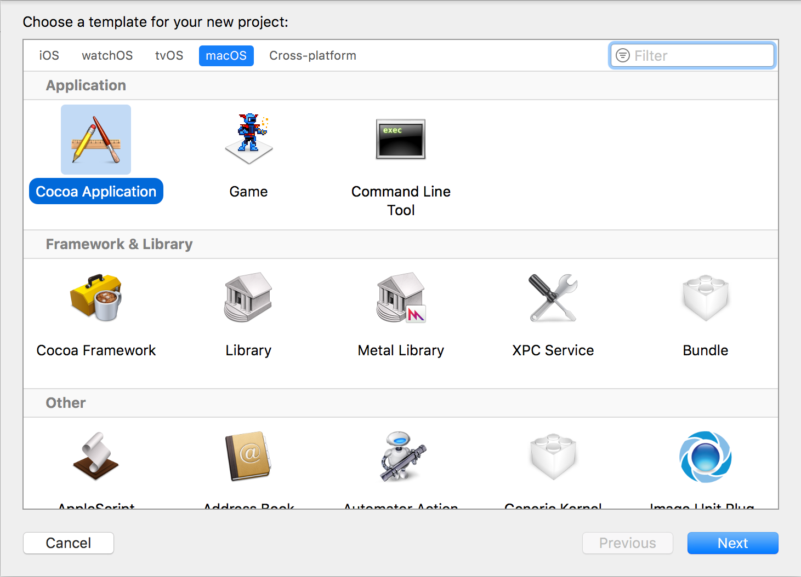
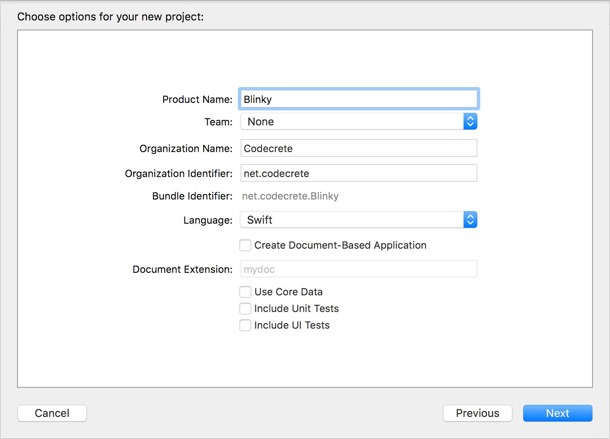
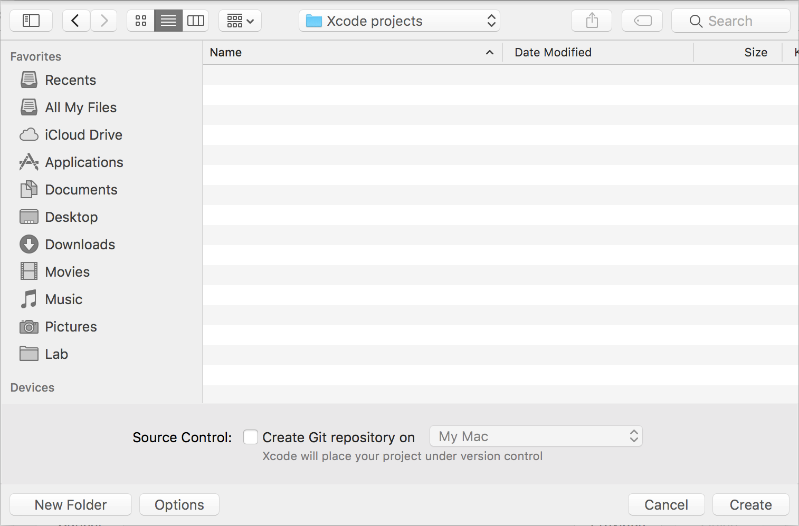
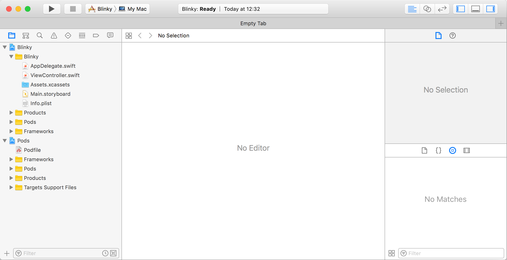

# Blinky and the Xcode project setup

This example will guide you through the Xcode project setup
for your first Wirekite project.


## Prerequisites

The setup assumes that you have already:

 - [loaded the Wirekite software onto the Teensy](https://github.com/manuelbl/Wirekite/blob/master/docs/prepare_teensy.md)
 - [installed CocoaPods](https://guides.cocoapods.org/using/getting-started.html)
 - connected the Teensy via USB to your Mac


## 1. Create Xcode project

Start Xcode and select *File* / *New* / *Project...* for the menu:



Select *Cocoa Application* as the project type and click *Next*.



Enter *Blinky* as the project name and click *Next*.



Save the project in a folder of your choice.

The project will then look like so:


## 2. Add CocoaPods

Open the Terminal and *cd* to the project directory. Then execute `pod init`:

```
MacBook:Blinky me$ pod init
```

The command creates an empty file called *Podfile* in the directory. Open it from Xcode and change it to:

```
platform :osx, '10.12'

target 'Blinky' do
  use_frameworks!

  pod 'WirekiteMac'

end
```

Go to terminal and exuecute `pod install`:

```
MacBook:Blinky me$ pod install
Analyzing dependencies
Downloading dependencies
Installing WirekiteMac (0.1.0)
Generating Pods project
Integrating client project

[!] Please close any current Xcode sessions and use `Blinky.xcworkspace` for this project from now on.
Sending stats
Pod installation complete! There is 1 dependency from the Podfile and 1 total pod installed.
```

This will modify your project and add the Wirekite library.

Now close the project in Xcode and open *Blinky.xcworkspace* instead. It should now look like so:




## 3. Add the *Blinky* code

Press cmd-B to build the project. That way, Xcode learns about the Wirekite library.

Then open the file *ViewController.swift* and change the code to:

```swift
import Cocoa
import WirekiteMac


class ViewController: NSViewController, WirekiteServiceDelegate {

    var service: WirekiteService? = nil
    var device: WirekiteDevice? = nil
    var timer: Timer? = nil
    var ledPort: PortID = 0
    var ledOn = false

    override func viewDidLoad() {
        super.viewDidLoad()
        
        service = WirekiteService()
        service?.delegate = self
        service?.start()
    }

    func deviceAdded(_ newDevice: WirekiteDevice!) {
        device = newDevice
        ledPort = device!.configureDigitalOutputPin(13, attributes: [])
        timer = Timer.scheduledTimer(withTimeInterval: 0.5, repeats: true) {
            timer in self.ledBlink()
        }
    }
    
    func deviceRemoved(_ removedDevice: WirekiteDevice!) {
        if device == removedDevice {
            device = nil
            timer?.invalidate()
            timer = nil
        }
    }
    
    func ledBlink() {
        ledOn = !ledOn
        device?.writeDigitalPin(onPort: ledPort, value: ledOn)
    }
}
```
Press cmd-R the build the project and run it. The LED on the Teensy board should now blink slowly.

That's it: you have succeeded in building and running your first Wirekite program.

## 4. The code

The code uses two classes and one protocol:

 - *WirekiteSerivce* notifies about Wirekite devices being connected or disconnected from your Mac.
 - *WirekiteServiceDeleage* is the protocol called by the service class when a device is being connected or disconnected.
 - *WirekiteDevice* offers the API to configure and set output and input pins etc.

 To use Wirekite, the library has to be imported:

```swift
import WirekiteMac
```

 When the window opens, an instance of the service is created and started:

 ```swift
override func viewDidLoad() {
  super.viewDidLoad()
  
  service = WirekiteService()
  service?.delegate = self
  service?.start()
}
```

The view controller registers itself as the service's delegate. So it implements the delegate protocol:

```swift
class ViewController: NSViewController, WirekiteServiceDelegate {
```

When a device connected, `deviceAdded:` is called:

```swift
func deviceAdded(_ newDevice: WirekiteDevice!) {
    device = newDevice
}
```

A reference to the device is stored in the instance variable `device`.

Additionally, an output pin is configured:

```swift
ledPort = device!.configureDigitalOutputPin(13, attributes: [])
```

Pin 13 is connected to the on-board LED on the Teensy LC.

A timer is now setup on the Mac to turn the LED on and off at a regular interval:

```swift
timer = Timer.scheduledTimer(withTimeInterval: 0.5, repeats: true) {
    timer in self.ledBlink()
}
```

The code for toggling the LED is in a separate function:

```swift
func ledBlink() {
    ledOn = !ledOn
    device?.writeDigitalPin(onPort: ledPort, value: ledOn)
}
```

If a device is disconnected, the timer should be stopped and the reference to the device released:

```swift
func deviceRemoved(_ removedDevice: WirekiteDevice!) {
    if device == removedDevice {
        device = nil
        timer?.invalidate()
        timer = nil
    }
}
```
